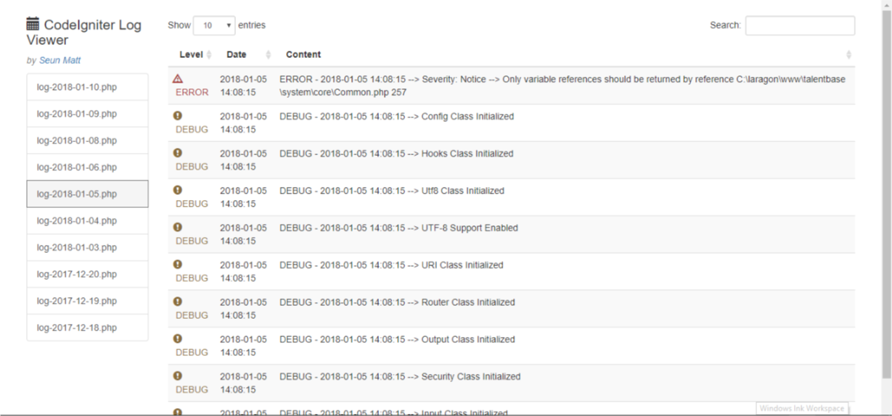

CodeIgniter Log Viewer
=======================

[](https://packagist.org/packages/seunmatt/codeigniter-log-viewer) [](https://packagist.org/packages/seunmatt/codeigniter-log-viewer) [](https://packagist.org/packages/seunmatt/codeigniter-log-viewer) 

This is a simple Log Viewer for viewing CodeIgniter logs in the browser

This project is inspired by the [laravel-log-viewer project](https://github.com/rap2hpoutre/laravel-log-viewer).

A typical log view looks like this:



Usage
=====

Composer Installation
---------------------
Execute:

```
composer install seunmatt/codeigniter-log-viewer
```

Controller Integration
----------------------


All that is required is to execute the `showLogs()` method in a Controller that is mapped to a route:

A typical Controller *(LogViewerController)* will have the following content:

```php
private $logViewer;

public function __construct() {
    $this->logViewer = new \CILogViewer\CILogViewer();
    //...
}

public function index() {
    echo $this->logViewer->showLogs();
    return;
}
```

Then the route *(application/config/routes.php)* can be configured thus:

```php
$route['logs'] = "logViewer/index";
```

And that's all! If you visit `/logs` on your browser 
you should see all the logs that are in *application/logs* folder and their content

NOTE
----
-  It is advisable to require authentication/authorization for the `/logs` path to keep it away from general public access 
and other security reasons.

Contributions
=============
Found a bug? Kindly create an issue for it. 

Want to contribute? Submit your pull-request

Remember to :star: star the repo and share with friends

Author
======
Made with :heart: by [Seun Matt](https://www.linkedin.com/in/seun-matt-06351955)

LICENSE
=======
[MIT](LICENSE)